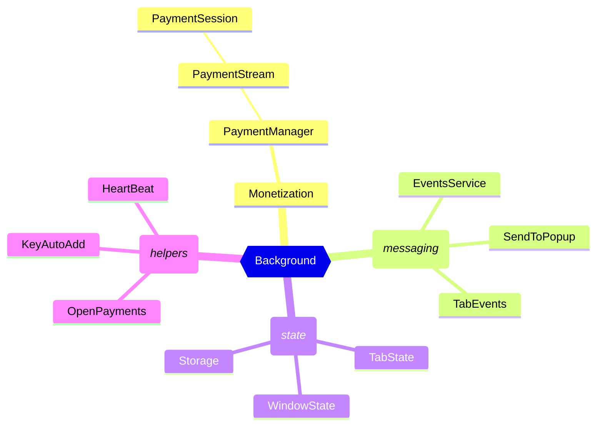

# Developer's Guide

Welcome, dear developer!

This guide is your starting point for developing the Web Monetization browser extension.

We're building a browser extension (cross-browser, including mobile browsers) to enable Web Monetization capabilities. This extension will bridge the gap until native browser support for Web Monetization is widespread.

## Project goals

- Accelerate Web Monetization Adoption: Bridge the gap until native browser support.
- Enable direct support of content creators with micro-payments, tips, and other OP/WM capabilities
- Experiment with what works, and what doesn't, with a faster feature feedback loop.
- Provide feedback on the Web Monetization standard, and documentation and suggest improvements to Open Payments.

## Required reading

To get started, familiarize yourself with the following:

- [Browser Extension docs from MDN](https://developer.mozilla.org/en-US/docs/Mozilla/Add-ons/WebExtensions)
- [Web Monetization](https://webmonetization.org/): Understand its core concepts and goals.
- [Open Payments](https://openpayments.dev/): Learn about the underlying protocol for Web Monetization.

Multiple readings will deepen your understanding. Start with a broad overview, then gradually focus on specific details.
For example, the first pass should help you understand browser extensions, how they work; what is Web Monetization (WM) and what it aims to solve; and what Open Payments are. In the second pass, you may go through different parts of a browser extension, how WM works, and how WM uses Open Payments flow. In later passes, you may incrementally go through various APIs in each.

## High-level architecture and technology stack

The extension adheres to a straightforward & standard structure, with a one-to-one mapping between source code and output. It's designed to be compatible with modern browsers that support Manifest Version 3 (MV3).

We make use of the following (essentially all) components of a browser extension:

- Background Script/Service Worker: The primary orchestrator and backend, responsible for:
  - Managing extension lifecycle
  - Handling network requests and data storage
  - Interacting with other extension components
- Browser Action/Default Popup: The primary user interface for:
  - Displaying extension status and settings
  - Triggering actions like connecting wallets or making one-time payments.
- Content Scripts:
  - To collect and monitor `<link>` tags for incoming-payment wallet addresses
  - To dispatch Monetization events that the website can listen to, and act as polyfill for WM JS API
  - Take control of wallet websites (after the user's consent) to help connect the extension via automatic key addition
- Extension Pages:
  - In-page Notifications and Overlays: Provide contextual information and prompts.
  - Dedicated Pages: Handle complex interactions or scenarios where the default popup is insufficient.

The code is written in TypeScript and React. For frontend styling, we make use of TailwindCSS.
The build process is powered by a hand-written `esbuild` setup (there's a convenient CLI to integrate most of the build process).
We use GitHub Actions for CI/CD & release pipelines, and there are some custom actions & JS scripts to help facilitate that.

## Development Environment Setup

You can set up your development environment on your preferred OS: Linux, MacOS, and Windows. As this is a git repo, the `git` setup is implicit.

### Installing necessary tools and frameworks

We primarily need Node.js and `pnpm` (package manager). So you should set them up as you see fit, as long as you use the same versions specified in the [README](../README.md). Once you've Node.js and pnpm, install dependencies with `pnpm i`.

Go through the [README](../README.md#setup) to learn about the setup & build process and how to load the built extension into browsers.

### Test Wallet

To use the extension, you'll need access to a wallet that supports Open Payments. Use [Interledger Test Wallet](https://wallet.interledger-test.dev/), as it won't cost you real money - its sole purpose is testing. Sign up for the test wallet, and get yourself a wallet address.

During the sign up process, it'll ask you for KYC details. As it's a test wallet, there's no real KYC. The only real information you need to provide is a valid email address and phone number, as you'll get a confirmation email and SMS. For other form fields, you can fill in any random data. For documents, even a blank piece of paper will do. For the liveness check, you can try your luck finding a 3D model of a human face, or give up and turn on the camera towards you. Your KYC will be approved automatically almost immediately.

### Configuring IDE/code editor

Use whatever IDE/code editor you're comfortable with.

We suggest your IDE supports syntax highlighting for TypeScript and React at least (unless you're ok working without syntax highlighting). Intellisense support for TS would be most helpful - to let you jump around functions and files. Additional plugins to support code formatting with [Biome](https://biomejs.dev/) and prettier integration would be helpful. For the frontend, having easy access to TailwindCSS class names is also good to have.

With VSCode, we include some plugin recommendations in the repo.

### Version control (Git)

We use `main` as the default development and release branch. All your PRs are to be merged in this branch. Do not push directly to `main` ever - every commit to main has to go in as a PR.

We follow conventional commit messages. You can use any commit message in your PR commits, but when we squash and merge your PR, we'll follow conventional commit message guidelines.

## Get familiar with Codebase

### Structure and organization

The high-level project directory structure is as follows:

```bash
.
├── .github/ # GitHub Workflows
├── docs/ # Repository documentation
├── esbuild/ # Esbuild configuration
├── scripts/ # Script to build the extension (production, development)
├── src/ # Extension's source code
│   ├── _locales/ # Files for multi-language support
│   ├── assets/ # Images for the extension (icon, etc.)
│   ├── background/ # Source code for the background script/service worker
│   ├── content/ # Source  code for the content scripts
│   │   ├── polyfill.ts # WM JS API polyfill, and to integrate events with website
│   │   ├── services/ # Services to extract & monitor link tags from websites user visits
│   │   └── keyAutoAdd/ # Content scripts for automatic key addition to wallets
│   ├── pages/ # Source code for extension pages, including popup
│   │   ├── popup/ # Source code for the popup UI
│   │   ├── app/ # Source code for the full screen extension page (post-install, more settings etc.)
│   │   ├── progress-connect/ # Source code for the progress-connect (notification/layover) UI
│   │   └── shared/ # Shared components and libraries for the frontend
│   ├── shared/ # Shared utilities
│   └── manifest.json # Extension's manifest - processed by Webpack depending on the target build
├── jest.config.ts
├── jest.setup.ts
├── package.json
├── tailwind.config.ts
└── tsconfig.json
```

In the background and in the content scripts, we have the concept of "services". Services are essentially classes with scoped objectives. The `index.ts` files mark the entry points.

We make use of [`awilix`](https://www.npmjs.com/package/awilix) for dependency injection; the `Cradle` interfaces define all the potential dependencies (in the container), and `awilix` takes care of injecting (and instantiating) those classes into services that need use them (as the services have same given name when used in constructor parameters). Some classes may also be instantiated manually.

Similarly, in the frontend, `index.tsx` and `index.html` define the entry points. We use React contexts (and some helper hooks, mainly via `context.tsx`) to "inject" dependencies into components - so we don't have to import them everywhere and can easily replace/mock for testing.

Each service/component/file is named so that you can have a general idea of what it does from its name. There are also some top-level comments in files when names may not be enough.

### Core components and their functionalities

#### Background

Background script/service worker (it's service worker in Chrome, and script in Firefox at the moment, but there's no specific difference from our perspective) is the backend of our extension. It runs locally on the user's device, not on a remote server. The background script is composed of various services:



- **`Background`**:
  - The "main" entry point for background.
  - Handles messages from popup and content scripts
  - Handles post-install & post-update events
  - Listens to many other "global" events and orchestrates other services to take action.
- **`MonetizationService`**:
  - The real orchestrator of payments, for all tabs
  - Sets up `PaymentManager`s
  - Handles messages from background/content-scripts/popup to maintain/update/control the payment sessions
  - **`PaymentManager`**
    - Manages payments for a tab
    - Abstracts all monetization link elements in a page, manages payment sessions
    - Keep track of what amount to send, which session to send to, and when to send
    - **`PaymentStream`**
      - Contains sessions for link elements in a "frame" within the tab
        (host website is main frame (id=0), rest are _iframes_)
      - **`PaymentSession`**:
        - Abstraction over a monetization link element
        - Calls OpenPayments APIs to make actual payments
        - Publish events to a website when a payment was sent
- **`OpenPaymentsService`**:
  - An abstraction over OpenPayments client
  - Preserves tokens, and manages a single client for all operations.
- **`StorageService`**:
  - An abstraction over `browser.storage.*` APIs
  - Also includes some in-memory storage helpers (to maintain data that goes away on browser close)
- **`TabState`**:
  - Keeps track of all `PaymentSession` for a tab
  - Provides tab-specific payment info & status
  - Preserves an "over-paying" state in case a website tries to get extra money by repeatedly refreshing its website.
- **`WindowState`**:
  - Tells about the current active window and tabs in each window.
  - Exists as the browser APIs for tabs info aren't doing all we need.
- **`TabEvents`**:
  - Listens to tab update/close events to update monetization state
  - Updates visual indicators (such as extension icon) based on the above changes
- **`Heartbeat`**:
  - Keeps the background script/worker alive during the entirety of the browser session.
  - It's expensive to restart the script, so we don't let it idle.
- **`SendToPopup`**:
  - Send messages from the background to popup via `Runtime.Port`
  - Exists as we send messages to the popup often, and sending via a regular message channel would be noisy.
- **`KeyAutoAddService`**:
  - Different wallets have different ways to upload public keys, and we don't want users to be scared by the complexity of "public keys"
  - This service complimented by its counterpart content scripts, takes control of the user's browser (after their consent) to add the key via reverse engineering how different wallets upload keys.
  - The backend part is for orchestration only.
- **`EventsService`**:
  - A simple EventEmitter/pub-sub service
- **`Deduplicator`**:
  - Essentially a function to cache certain async function calls (promises) for a few seconds and then eventually clear their memory

#### Content scripts

The main content script has the following services:

- **`ContentScript`**:
  - Main orchestrating service
  - Handles messages, controls other services
  - Injects polyfill in a hacky manner when the browser doesn't support the "MAIN" execution world.
  - It's injected once in every frame (top-level frame as well as each iframe) on each tab.
- **`MonetizationLinkManager`**:
  - Finds and monitors HTML `<link rel="monetization">` tags and asks background script to monetize them (i.e. set up payment sessions and send payments)
  - Handles start/stop/pause/resume of payment sessions depending on various factors (page visibly, page idle)
  - Dispatches (in conjunction with polyfill) various events to the web page.
- **`FrameManager`**:
  - Handles monetization of `<iframe>` in conjunction with `MonetizationLinkManager`

##### Key auto add

Includes scripts to automatically upload public keys to different wallets. The way to add a key is reverse-engineered and can break at any time. Each script can only run on specific wallet URLs, after consent from the user (in popup).

The scripts are defined as steps, so if a step fails, it'll help us debug which part we need to reverse engineer (yes, it's a cat-and-mouse game thing). The steps also let the user stay informed of the process and progress.

##### Polyfill

This content script serves as a polyfill for the WM JS API. It lets a website:

- Know if web monetization is supported (via the existence of global `MonetizationEvent` and updating `HTMLLinkElement` interface)
- Adds support for `<link rel="monetization">`
- Dispatches monetization events on appropriate link tags, and `window` (via bubbling).

This script runs in `"MAIN"` context: so its globals are available to the website to access.

#### Extension pages

##### Popup

Popup (technically, the [browser action -> default popup](https://developer.chrome.com/docs/extensions/reference/api/action#popup)) is what users will interact with. It's a React SPA written in TypeScript and uses Tailwind for styling.

- The `pages` directory contains the routes/screens the user can go to.
- The `lib` directory includes reusable functions and utilities, along with their unit tests.
- The `components` directory contains re-usable (or sometimes singly usable) components.
  - We try to keep the components as pure as possible.
  - Most of the integration is to be done in pages only, so the components can include a lot of props.
  - The `useTranslation` hook (see `TranslationContext`) can be considered pure, as its default values don't rely on any external APIs.

##### Other pages

- `app`: The full screen extension page, used for post-install screen and showing additional settings in future. Anything user facing we feel popup isn't the right place for, can belong to this app (popup is for quick things user will interact with most often or expect them to be available in the popup).

- `progress-connect`: Related to KeyAutoAdd services, this extension page (also a React SPA) gets injected into wallet provider websites as an iframe. It can serve as a notification UI and as a full-page overlay during automatic public-key addition. The content scripts and the popup communicate to it via the background and runtime ports.

#### `manifest.json`

The manifest file tells the browser what file in our extension serves what purpose, what permissions we need, and some other metadata like the name & version of the extension.

The build scripts manipulate & process `src/manifest.json` depending on the build environment (dev vs production) and the browser.

Please read the [MDN docs](https://developer.mozilla.org/en-US/docs/Mozilla/Add-ons/WebExtensions/manifest.json) or [Chrome developers docs](https://developer.chrome.com/docs/extensions/reference/manifest) to understand various aspects of `manifest.json`.

Note that, we only support [manifest version 3](https://developer.chrome.com/docs/extensions/develop/migrate/what-is-mv3), and not version 2.

### Payment mechanism

1. The content script finds the valid `<link rel="monetization">` elements and sends a message to the background.
2. The background then sets up a payment session for this element - via `Monetization` (singleton for browser instance) → `PaymentManager` (for tab) → `PaymentStream` (for frame) → `PaymentSession` (for element).
3. Once a payment is made, the `PaymentSession` passes on an event to the website (via `polyfill.ts`), and in turn a `MonetizationEvent` is emitted.

#### `minSendAmount`

When a `PaymentSession` is created, we find a `minSendAmount` before we try to make any payment. This value is used in figuring out the amounts and timings for the payments for given link element. The `minSendAmount` is obtained by creating a quote with particular amount and seeing if the quote is accepted at that amount.

The `minSendAmount` is a property of user's connected wallet, the wallet of the link tag and associated fees at that time. For a browsing session (which _resets_ on navigation), we typically find this amount only once. But if future payments fail, we may need to adjust the `minSendAmount` again.

We make payments only in multiples of `minSendAmount`. This ensures some fairness for the sender and receivers - as the amounts higher than in-multiple of `minSendAmount` are absorbed by ASEs to maintain cross-currency liquidity for other transactions when user may send an amount less than multiple of `minSendAmount`.

#### Open-payments flow

To make a payment with Open Payments, following steps are taken (presuming we've the OutgoingPaymentGrant tokens available, i.e. user has connected the extension to their wallet):

1. Create incoming payment:
   1. Set up a non-interactive incoming payment grant for the receiving wallet address.
   1. Create an incoming payment using this grant for the receiving wallet address.
   1. Optionally, cancel the incoming payment grant, as we no longer need it (we already have the incoming payment). This prevents users wallet seeing _dangling_ grants in their wallet.
1. Find the `minSendAmount`:
   1. Find a possible amount for the receiving wallet using various heuristics (currency exchange rate, asset scales, asset codes etc.)
   2. Exponential probing: Try creating a quote with this amount until it doesn't fail with a "non-positive receive amount" error (i.e. the receiver has to receive at least one unit for a quote to succeed), increasing it in an exponential manner.
      - If the OpenPayments request with a "non-positive receive amount" error, error and includes a `minSendAmount` in error details (this is a relatively recent OpenPayments feature), stop the process to find the minimum sendable amount her1.
   3. Binary search: Once a sendable amount is found, use binary search (between the sendable amount and previously attempted amount) to find the minimum sendable amount.
1. Create outgoing payment:
   1. Call the create outgoing payment OpenPayments API to create a fix-send outgoing payment. Include the following details:
      - `accessToken`: The access token for the outgoing payment grant (i.e. the one we get from connecting the wallet). This token needs to be rotated once in a wIfIf the token is expired, try the payment again with a refreshed token.
      - `incomingPayment`: The incoming payment ID/URL we got in step 1.
      - `debitAmount`: The amount we want to send.

#### One-time payments

When a user wants to send one-time payment, we distribute the amount chosen by the user across the _payable_ payment sessions, while respecting the `minSendAmount` of each session.

We then create multiple payments as described the flow above, to each session that gets a non-zero amount following the above distribution.

The distribution logic is defined in [#1098](https://github.com/interledger/web-monetization-extension/pull/1098).

#### Continuous payments

Continuous payments involve a timing component, managed by `PaymentManager`.

Depending on the user's chosen rate of pay, we find the interval at which we can increase a "pending amount" that can be paid out. Every "interval" ms, we increment the pending amount by some units.
The interval can't be lower than `MIN_PAYMENT_WAIT` - which defines a minimum time between consecutive payments, for performance reasons. We adjust the interval and increment accordingly.

From the multiple payment sessions, then we have to choose the session we want to pay next. How sessions are chosen is defined in [#1066](https://github.com/interledger/web-monetization-extension/pull/1066), but essentially we go sequentially in the order we loaded the link elements, while prioritizing the sessions on the "main frame" (host website over iframes).

<details>

- First, go through all payable link tags on the main website, one by one.
- Then, pay the first link in the first iframe, then the first link in the second iframe.
- Then, again go through all payable link tags on the main website.
- Then, pay the second link of the first iframe, then the second link (if it doesn't exist, then the first again) of the second iframe.
- Then, again go through all payable link tags on the main website.
- Then, again pay the first link in the first iframe, then the first link in the second iframe, and so on.

</details>

The "pending amount" acts like a bucket, and we empty the bucket by making a payment in a multiple of the chosen session's `minSendAmount` (the bucket isn't always emptied depending on the values of increments and min-send amounts). If there's not enough pending payment, we wait until there is (but still paying the same chosen payment session), and then move onto the next payment session.

We keep doing this indefinitely (until monetization is stopped by some user action or long inactivity), cycling through the payment sessions.

## Testing and Debugging

### Unit Testing

**Target:** Focuses on testing individual functions and React components.
**Tools:** Leverages `jest` as the test runner and `@testing-library/react` for efficient frontend testing.
**Execution:** Run unit tests with the command `pnpm test`.
**Best Practices:** Strive for minimal reliance on global state and mocks. Pass required parameters directly to functions and components for cleaner testing.

### Integration Testing

While not currently implemented, this could involve testing interactions between different parts of the extension using jest.

### End-to-End Testing

**Tool:** We use Playwright for E2E testing.
**Process:** Refer to the dedicated [TESTING.md](./TESTING.md) document for detailed instructions.

### Debugging

- **Browser Developer Tools:** Leverage the built-in debugging tools in Chrome or Firefox for inspecting the extension's behavior. In Chrome, you can "inspect service worker" from `chrome://extensions/` page. In Firefox, "Inspect" from `about:debugging#/runtime/this-firefox`. You can open popup as separate tab for some kinds of inspection, or Right-click extension icon and "Inspect popup".
- **Small Services:** For isolated services, run them individually in Node.js using the `tsx` CLI to facilitate debugging.
- **Test-First Approach:** Consider a test-first development approach where you write tests before implementing functionality, which can aid in catching issues early on.

## Feature Planning and Design

Write clear and concise user stories. If a story/task is missing details, ask for additional information.

Break down features into smaller tasks. Split large issues into sub-tasks. Feel free to create multiple link GitHub issues if the story is too big, or use simple TODO lists in the story.

UI/UX: Provide your idea from an engineering perspective, run it through the product; and then ask the design team for fine-tuned designs if needed. We use Figma for designs. Push back against large breaking changes to UI (unless really necessary), as existing users might get confused & annoyed with our continuous updates.

Team Collaboration: Collaborate and share knowledge within the team. Discuss issues publicly on GitHub. If conversations go on too long or are slow, fall back to Slack messages, huddles/meetings. Prefer group messages over DMs so more people are aware of the tasks. But add decisions/meeting notes to GitHub for transparency. Attend various weekly/biweekly calls for general discussions and proposals with a larger audience.

## Implementation

Write clean, maintainable, and efficient code. Focus on clarity over performance. Add comments for the whys, and not the hows. Don't write long functions, split chunks into smaller helper functions. Use whitespace as separation for concerns within larger procedures.

Adhere to existing coding standards and best practices. Try to write code that feels part of existing code. If you disagree with the existing code, feel free to suggest changes.

Keep accessibility & usability in mind when adding any new components.

Leverage existing browser APIs and extensions APIs. If you think a certain API should exist, it probably exists - so check before implementing own. For small utilities/polyfills, prefer to copy-paste code (with proper attribution in comments) over adding npm packages.

Test the implementation thoroughly. It won't be a good impression to send a PR without running it locally yourself. Try manual end-to-end tests for each new change, preferably in different browsers. Add unit tests for each new utility you add. Add end-to-end tests for large behavioral changes. For frontend components, test behavior instead of DOM snapshots.

### Code Review and Feedback

Understand the [code review process](../.github/CONTRIBUTING.md#review-process).

Suggested reading: [How to write code review comments from Google](https://google.github.io/eng-practices/review/reviewer/comments.html)

For UI changes, add screenshots or recordings with your PR.

## Deployment and Release

Read [RELEASE.md](./RELEASE.md).

## Best Practices

### Privacy & Security

Protect user data and privacy. Keep sensitive data within the browser, don't ever transmit it.

Be careful adding any third-party endpoints other than Open Payments endpoints. Avoid them if you can.

Audit any third-party packages, including their updates - automatically and manually. Only use open source packages, and lock their versions.

Take extra care as we've grants with sensitive accesses - access to user's money. Ensure they don't get passed to any telemetry service (that will get added in the future), including via `console.log`.

Ask for the user's consent before taking any sensitive action on their behalf. Make sure user feels in control - the extension is to ease them, not take control away from them.

Box access to sensitive information. Don't let your components know too much. Keep separation of concerns to make things easier to audit.
For example, our frontend doesn't interact with `browser.storage` APIs at all. We manage all storage operations via message passing with background. In the future, we can strictly prevent access to certain APIs from certain contexts (e.g. with [LavaMoat](https://github.com/LavaMoat/LavaMoat)).

### Performance Optimization

Identify and fix performance bottlenecks via theoretical knowledge as well as browser dev tools.

Optimize images and minify JavaScript output. Use [TinyPNG](https://tinypng.com)/[Squoosh](https://squoosh.app) for images, [SVGOMG](https://jakearchibald.github.io/svgomg/) for SVGs, and the existing build process to minify JS. Use [bundle size analyzer](https://esbuild.github.io/analyze/) to keep the bundle sizes and dependencies in control.

Optimize for CPU and memory as our extension keeps running during the entire time the browser is open. Optimize for CPU even at the expense of memory. We don't want to be known for battery drain.

Focus on optimizing content scripts as they get injected into every page (high multiplication factor). Background runs a single instance, so the risk is reduced there, but remember background often does more work and keeps running continuously.

### Cross-Browser Compatibility

Understand browser differences and quirks. The web platform has plenty of compatibility issues, but extensions are even wilder.

Prefer feature detection over user-agent/build-time info. Add polyfills to overcome differences. When adding polyfills, make an effort such that bundle size for browsers that don't need polyfill stays like before. We use `webextension-polyfill` for a consistent development experience, but make sure you understand its limitations also.

Test the extension on different browsers and platforms. Do manual as well as automated tests.

---

Closing words: Happy hacking!
