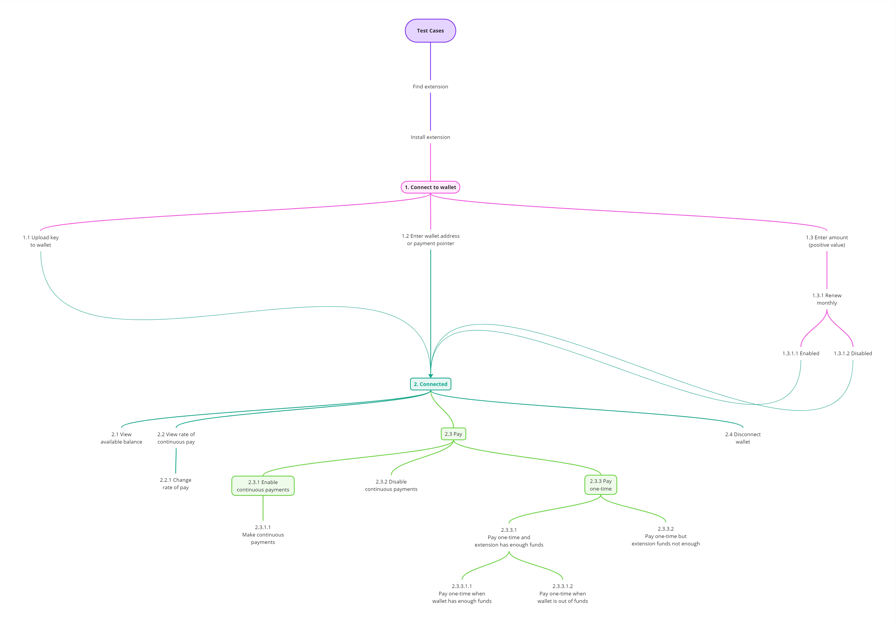

# Web Monetization Extension Test Plan

## Introduction
The purpose of this document is to guide end-user testing of the Web Monetization browser extension.

## Audience
Any person interested in testing the beta release of the Web Monetization extension. 
There is no requirement for technical competencies.

We focus on functional test cases, and the goal is to record and report the actual behaviour that was observed when it differs from the expected behaviour.

## Strategy
One of the strategic goals of the Interledger Foundation is to grow Web Monetization awareness and adoption such that there are 1,000 web monetized websites and 100,000 active Web Monetization users (by 31 December 2024).

One of the long-term goals is to grow Web Monetization adoption by a factor of 10, in the next 5 years (by December 2029) such that Web Monetization functionality is either native to the most widely used Web browsers, or readily available through browser extensions on Web browser stores and marketplaces.

## Objectives
1. Validating that, once installed, users can configure Web Monetization settings on the extension.
2. Validating that once the extension is successfully connected to a digital wallet, a user is able to.
3. For web monetized websites, verify that the monetization event gets triggered.

## Dependencies
### Digital Wallets
Web Monetization-enabled digital wallets are provided by licensed service providers who are regulated by the laws of the countries in which they operate. They provide digital wallets that can send or receive Web Monetization payments.

Wallet availability in a specific country, or availability in particular currency depends on the wallet provider.
To learn more, visit a specific wallet provider’s website. Below are the available wallet providers: 
- [Fynbos](https://wallet.fynbos.app/wallet)
- [GateHub](https://gatehub.net/mobile)

## Testing
### Tools and Resources
The resources and tools that you will need to test Web Monetization depend on your point of view. 
The Web Monetization personas have different perspectives and needs for testing:

Persona 2: A website owner that wants to receive WM payments.

| People                        | Hardware                     | Digital wallet | Environment & software |
| :---------------------------- | :--------------------------- | :------------- | :--------------------- |
| **Persona 1**: A website visitor that wants to pay websites that are web monetized. | Any PC with internet access. | A Web Monetization enabled digital wallet from which payments will be made. | Any operating system (OS). A chromium-based Web browser (e.g. Chrome, Edge, Brave) or Firefox |
| **Persona 2**: A website owner that wants to receive WM payments. | Any device with internet access (e.g. PC, tablet, mobile device). | A Web Monetization enabled digital wallet into which payments will be received. | Any operating system (OS). Any Web browser |

### Report Issues
1. Use any screen recording application to record the steps and results of your testing.
2. Log bugs or issues, and tracking their resolution status in GitHub (link).

### Prerequisites
The main prerequisite for sending or receiving Web Monetization payments is to have a Web Monetization-enabled digital wallet.  
Learn more about [compatible wallets here](https://webmonetization.org/docs/resources/op-wallets/#fynbos). 

> [!NOTE]
> The wallet signup process depends on your wallet provider, and your country.   
> In most countries, the process includes verifying your identity, as mandated by the law. This can take hours or days.  
> Once your wallet signup completes, you should be able to:  
> (1) Setup your wallet accounts, currencies, balances etc.  
> (2) Obtain the wallet address or payment pointer to use for Web Monetization.

### Test Data
This is a guide how you can setup conditions for testing the Web Monetization extension on websites:

 | Web monetized websites           | Non monetized websites       |
 | :----------------------------    | :--------------------------- |
 | One valid monetization link tag  | No monetization link tags    |
 | Multiple valid monetization link tags with wallet addresses: <ul><li>from the same wallet providers</li><li>from different wallet providers</li><li>with different currencies</li><li>with some link tags enabled & some disabled</li></ul> | <ul><li>One disabled link tag</li><li>Multiple disabled link tags</li></ul> |

### Test Playground
 Use the [Web Monetization playground](https://webmonetization.org/play/) to quickly create different monetization conditions on a test website for monetization.
 Use the playground to add, remove, or disable any number or combination of wallet addresses and payment pointers on the playground.

### Risk Areas
This section defines and priorities the main risks to the adoption of Web Monetization.
Based on these risks, the sections that follow detail the actual test cases.

We use 4 risk priorities: `critical`  |  `high`  |  `medium`  |  `low`

 | Ref.       | Risk                                                        | Priority     | How to mitigate the risk       |
 | :--------- | :---------------------------------------------------------- | :----------- | :----------------------------- |
 | R1         | Product not easily accessible                               | high         | The extension is: <ul><li>Readily accessible where the majority of people are, on the Web</li><li>Easy to find</li></ul> |
 | R2         | Onboarding is long or complicated                           | critical     | <ul><li>Installation is simple</li><li>Onboarding that is simple and clear</li><li>Support a reasonably quick start</li><li>Provide good quality support to simplify obtaining a wallet for sending or receiving WM payments (i.e. easy to contact, responsive, proactive support)</li></ul>  |
 | R3         | Lack of trust about the security of funds                   | critical     | <ul><li>Uncertainty about the security of my funds:<ul><li>Is my money safe?</li><li>Where is my money?</li><li>Can I easily see how much I have used?</li><li>Can I easily query issues about WM funds sent or received?</li></ul></li><li>Provide assurance and clarity about the security of funds</li><li>Allow users to view the balance of funds available to the extension from their wallet, in real-time</li><li>Build confidence by providing resources to empower people to use the tech for themselves, with real money, or in a playground environment using “play” money</li></ul> |
 | R4         | Lack of understanding about the standard or the technology  | high         | <ul><li>Provide accessible, good quality resources to simplify understanding:<ul><li>Web Monetization</li><li>The extension</li><li>How to start using the extension</li><li>How to monetize own content</li></ul></li><li>Provide good quality of docs (accurate, comprehensive, complete)</li><li>How WM works & what to expect</li><li>Understanding the technology</li><li>Access to the (draft) standard spec. & WICG GitHub repository</li></ul>
 | R5         | UX that is poor                                             | critical     | <ul><li>Build UX that supports ease of use</li><li>Provide fast and responsive helpdesk support to resolve issues</li><li>Gather user feedback, and continuously improve UX and functionality</li></ul>
 | R6         | Unable to control payments                                  | critical     | <ul><li>Ability to control when, who & how much to pay</li></ul>

### Functional Test Cases
This diagram shows the test cases that will be covered (source: [Miro Board link](https://miro.com/app/board/uXjVKu354WI=/?moveToWidget=3458764595787822957&cot=14)).  

#### Basic Test Cases
The test case IDs below align with the numbering shown in the test case diagram above.

##### Test ID: 1  
**Function**: Connect to a wallet  
**Description**: Connect the extension to a Web Monetization enabled digital wallet.  
**Risk**: R2 (onboarding) and R5 (UX)  
**Preconditions**:  
1. You have already downloaded and installed the Web Monetization extension. 
2. Your digital wallet sign-up and account activation is complete (learn more from the [Prerequisites](#Prerequisites) section)

**Steps**:  
1. Open the WM extension and copy the extension’s key.
2. Open the digital wallet, and load the extension’s key into the wallet.  
3. From the digital wallet, find and copy the wallet address or payment pointer.  
4. Open the WM extension, and enter the wallet address or payment pointer.  
5. Enter the amount you want to make available to the extension, from your wallet (the amount must be a positive value).  
6. Monthly renewal of amount remains disabled.  

**Expected results**:  
1. The wallet owner receives an interaction prompt from their wallet, to authorize the connection and access to the amount.  
2. The icon and behaviour of the extension will depend on the Web Monetization status of a visited website.

##### Test ID: 2.3.1.1
**Function**: Make continuous payments  
**Description**: Send continuous WM payments to a monetized website.  
**Risk**: R3 (security of funds)  
**Preconditions**:  
1. The extension is connected to your wallet. 
2. The extension has a positive remaining balance.
3. Your wallet balance is equal to or greater than the extension’s remaining balance.

**Steps**: 
1. Visit a monetized website. Refer to the [Test Data](#Test-Data) section to explore different WM conditions for websites.  
2. Visit a non-monetized website. Open the extension to observe its available options.

**Expected results**:  
 | Web monetized websites                                   | Non monetized websites                                  |
 | :------------------------------------------------------- | :------------------------------------------------------ |
 | Extension icon: active (full colour), with a green tick  | Extension icon: active (full colour), but with a red X  |
 | Opening the extension displays a **rate of pay** slider:<ul><li>On the left, the current hourly rate in the currency of the wallet.</li><li>The default is equivalent to 0.60 USD.</li><li>The remaining balance, updated in near real-time (i.e. every few seconds).</li></ul>  | Opening the extension displays: <ul><li>This website is not monetized.</li></ul>

 ##### Test ID: 2.3.3.1.1
 **Function**: Pay one-time when extension and wallet have enough funds.  
 **Description**: Send a one-time payment to a monetized website when the remaining balance for the extension is sufficient for the payment, and the wallet has sufficient funds  
 **Risk**: R3 (security of funds) and R6 (control my payments)  
 **Preconditions**: 
 1. The extension is connected to your wallet.
 2. The extension has a positive remaining balance.
 3. Your wallet balance is equal to or greater than the extension’s remaining balance.

**Steps**: 
1. Visit a monetized website. Refer to the [Test Data](#Test-Data) section to explore different WM conditions for websites.
3. Open the extension and make a one-time payment, a positive amount that is lower than the “remaining balance” of the extension.
4. Visit a non-monetized website. Open the extension to observe its available options.

**Expected results**:  
 | Web monetized websites                                   | Non monetized websites                                  |
 | :------------------------------------------------------- | :------------------------------------------------------ |
 | Extension icon: active (full colour), with a green tick  | Extension icon: active (full colour), but with a red X  |
 | Opening the extension displays: <ol><li>**Rate of pay slider**: rate of pay and currency on the left, the remaining balance of the extension’s authorized amount on the right side</li><li>**“Send now” button**: clicking the button to send a one-time payment changes the text to “Payment successful” for a few seconds, and the text defaults back to “Send now”</li><li>**Amount**: the one-time payment amount resets to zero</li><li>**Remaining balance**: decreased by the value of the one-time payment</li></ol> | Opening the extension displays: <ol><li>This website is not monetized</li></ol> |

##### Test ID: 2.3.3.1.2
**Function**: Pay one-time when wallet is out of funds  
**Description**: Send a one-time payment to a monetized website when the extension has a sufficient remaining balance but the wallet has insufficient funds.  
**Risk**: R3 (security of funds) and R6 (control my payments)  
**Preconditions**:   
1. The extension is connected to your wallet.
2. The extension’s remaining balance is greater than the one-time payment you are going to make.
3. There are insufficient funds in your wallet for the one-time payment you want to make.  

**Steps**:  
1. Visit a monetized website. Refer to the [Test Data](#Test-Data) section to explore different WM conditions for websites.
2. Open the extension and make a one-time payment, a positive amount that is lower than the “remaining balance” of the extension, and ensure that the amount is greater than the available balance of the connected wallet.
3. Visit a non-monetized website. Open the extension to observe its available options.  

**Expected results**:  

 | Web monetized websites                                   | Non monetized websites                                  |
 | :------------------------------------------------------- | :------------------------------------------------------ |
 | Extension icon: active (full colour), with a green tick  | Extension icon: active (full colour), but with a red X  |
 | Opening the extension displays: <ul><li>**A slider**: with the hourly rate of pay and currency on the left, and the remaining balance of the extension’s authorized amount on the right side.</li><li>**The “Send now” button**: clicking the button to send a one-time payment results in…<continue_here>...</li></ul> | Opening the extension displays: <ol><li>This website is not monetized.</li></ol> |

##### Test ID: 2.3.3.2
**Function**: Pay one-time when extension funds are insufficient.  
**Description**: Send a one-time payment to a monetized website for an amount that is greater than the remaining balance of the extension, while the wallet does have sufficient funds.  
**Risk**: R3 (security of funds) and R6 (control my payments)  
**Preconditions**:   
1. The extension is connected to your wallet.
2. The extension’s remaining balance is lower than the one-time payment you will make.
3. Your wallet balance is greater or equal to the one-time payment you will make.  

**Steps**:  
1. Visit a monetized website. Refer to the [Test Data](#Test-Data) section to explore different WM conditions for websites.
2. Open the extension and make a one-time payment, a positive amount where the value is greater than the “remaining balance” of the extension.
3. Visit a non-monetized website. Open the extension to observe its available options.  

**Expected results**:  

 | Web monetized websites                                   | Non monetized websites                                  |
 | :------------------------------------------------------- | :------------------------------------------------------ |
 | Extension icon: active (full colour), with a green tick  | Extension icon: active (full colour), but with a red X  |
 | Opening the extension displays: <ul><li>**A slider**: with the hourly rate of pay and currency on the left, and the remaining balance of the extension’s authorized amount on the right side.</li><li>**The “Send now” button**: attempting to make a one-time payment that is greater than the remaining balance fails with an error: 
`Not enough funds to facilitate payment`</li></ul> | Opening the extension displays: <ol><li>This website is not monetized.</li></ol> |

##### Test ID: 2.3.2
**Function**: Disable continuous payments.  
**Description**: Disable the extension’s ability to make any continuous Web Monetization payments.  
**Risk**: R3 (security of funds) and R6 (control my payments)  
**Preconditions**:   
1. The extension is connected to your wallet.

**Steps**:  
1. Visit a monetized website. Refer to the [Test Data](#Test-Data) section to explore different WM conditions for websites.
2. Open the extension, and view of the remaining balance available to the extension.
3. Disable “Continuous payment stream”.
4. Observe the extension's icon when you visit a web monetized and non-monetized websites.

**Expected results**:  

 | Web monetized websites                                   | Non monetized websites                                  |
 | :------------------------------------------------------- | :------------------------------------------------------ |
 | The extension icon appears inactive (i.e. grey in colour), with a green tick  | The extension icon appears inactive (i.e. grey), but with a red X  |
